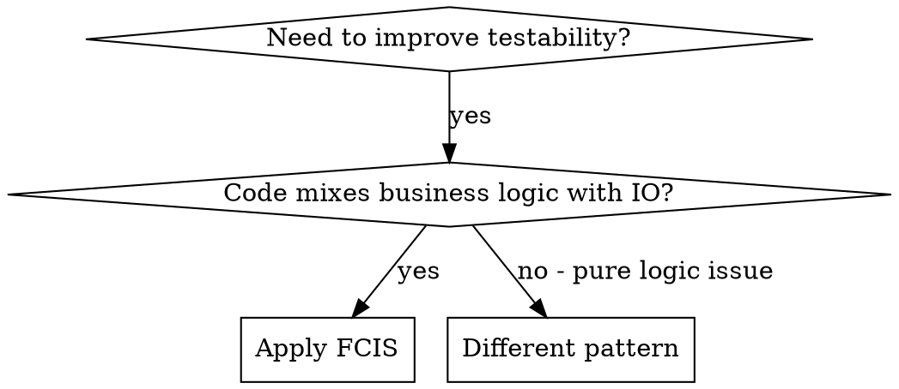
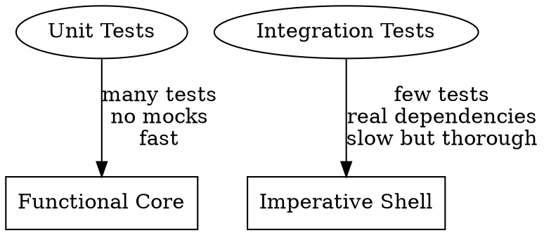

# Functional Core, Imperative Shell

## Overview

**Separate decisions from dependencies.** The functional core contains ALL conditionals and business logic. The imperative shell contains ALL IO and external dependencies. This makes the bulk of your code trivially testable without mocks.

This pattern comes from Gary Bernhardt's "Boundaries" talk. The key insight: **the value is the boundary**—not method calls, not interfaces, but simple immutable data flowing between components.

## When to Use



- System is hard to test (requires mocks, stubs, test databases)
- Business logic is tangled with database/network/file IO
- Want to enable easy parallelization later
- Need to reason about correctness of complex rules

**Not for:** Simple CRUD with no business logic, scripts that are inherently sequential IO

## The Two Layers

| Aspect | Functional Core | Imperative Shell |
|--------|-----------------|------------------|
| Contains | ALL decisions, ALL conditionals | ALL dependencies, ALL IO |
| Paths | Many (complex logic) | Few (just orchestration) |
| Dependencies | Zero | Many |
| Mutation | None (immutable data in/out) | Manages state, calls IO |
| Testing | Unit tests, NO mocks needed | Integration tests only |
| Size | Bulk of application (80%+) | Thin wrapper (20% or less) |

## Core Pattern

### Before (Tangled)

```python
class Sweeper:
    def sweep(self):
        users = User.all()  # IO: database
        for user in users:
            if user.active and user.last_paid < month_ago():  # Decision
                UserMailer.billing_problem(user)  # IO: email
```

Testing requires: database setup, email mocking, date mocking.

### After (FCIS)

```python
# === FUNCTIONAL CORE ===
# Pure function: decisions only, no IO
def find_expired_users(users: list[User], now: datetime) -> list[User]:
    month_ago = now - timedelta(days=30)
    return [u for u in users if u.active and u.last_paid < month_ago]

# === IMPERATIVE SHELL ===  
# Orchestration only: IO, zero conditionals
class Sweeper:
    def sweep(self):
        users = User.all()                          # IO: database
        expired = find_expired_users(users, now())  # Call pure function
        for user in expired:
            UserMailer.billing_problem(user)        # IO: email
```

Testing `find_expired_users`: just pass values, assert values. No database, no mocks, no setup.

## Key Principles

### 1. Values Are Boundaries

The communication between components is **immutable data**, not method calls:

```python
# BAD: boundary is a method call with side effects
sweeper.process_user(user)  # What does this do? Who knows.

# GOOD: boundary is a value
expired_users = find_expired_users(all_users, now)  # Clear input -> output
```

This affords:
- Easy reasoning (data in, data out)
- Process boundary shifting (values can be sent between threads/processes)
- Composability (pipe outputs to inputs)

### 2. Shell Has ZERO Conditionals

If your shell has `if` statements, you're doing it wrong. Move ALL decisions to the core:

```python
# BAD: conditional in shell
def sweep(self):
    for user in User.all():
        if should_notify(user):  # Decision leaked into shell!
            notify(user)

# GOOD: shell just orchestrates
def sweep(self):
    users = User.all()
    to_notify = find_users_to_notify(users)  # Decision in core
    for user in to_notify:
        notify(user)  # Pure orchestration
```

### 3. Immutable Data Throughout

Use frozen dataclasses, namedtuples, or similar:

```python
@dataclass(frozen=True)
class User:
    id: str
    active: bool
    last_paid: datetime

@dataclass(frozen=True)  
class NotificationResult:
    user: User
    sent_at: datetime
    success: bool
```

Nested composition preserves all data without mutation:
```python
@dataclass(frozen=True)
class ProcessedPage:
    raw: RawPage           # Original preserved
    layout: LayoutResult   # Added enrichment
    ocr: OCRResult         # More enrichment
```

### 4. Generic Result Types

Use typed wrappers for pipeline results instead of exceptions:

```python
from typing import Generic, TypeVar

T = TypeVar("T")

@dataclass(frozen=True)
class Success(Generic[T]):
    """Successful processing result."""
    value: T

@dataclass(frozen=True)
class Skipped:
    """Item intentionally skipped."""
    reason: str

@dataclass(frozen=True)
class Sentinel:
    """End-of-stream marker."""
    pass

# Type alias for pipeline items
PipelineItem = Success[T] | Skipped | Sentinel
```

This enables functional error handling without exceptions in the core.

### 5. Inject Time and Randomness

Never call `datetime.now()` or `random()` inside the functional core:

```python
# BAD: impure (depends on current time)
def is_expired(user):
    return user.last_paid < datetime.now() - timedelta(days=30)

# GOOD: pure (time injected)
def is_expired(user, now: datetime):
    return user.last_paid < now - timedelta(days=30)
```

## Testing Strategy



| Layer | Test Count | Mocks | Speed | Focus |
|-------|------------|-------|-------|-------|
| Functional Core | Many (cover all paths) | Zero | <1ms each | Correctness of logic |
| Imperative Shell | Few (cover wiring) | Minimal | Slower | Dependencies connect correctly |

**Why this works:** The functional core has many paths but no dependencies (easy to unit test). The shell has many dependencies but few paths (easy to integration test).

## FoO: Functional Object-Oriented

The fourth programming paradigm—combining immutability with objects:

| Paradigm | Mutation | Data + Code |
|----------|----------|-------------|
| Procedural | Yes | Separate |
| OO | Yes | Combined (objects) |
| Functional | No | Separate |
| **FoO** | **No** | **Combined (objects)** |

In FoO, you have objects with methods, but methods return NEW objects instead of mutating:

```python
# Traditional OO: mutation
class Cursor:
    def down(self):
        self.position += 1  # Mutates self

# FoO: functional objects
@dataclass(frozen=True)
class Cursor:
    tweets: tuple[Tweet, ...]
    position: int
    
    def down(self) -> "Cursor":
        """Return new cursor one position down. Pure."""
        new_pos = min(self.position + 1, len(self.tweets) - 1)
        return Cursor(tweets=self.tweets, position=new_pos)

# Shell updates reference to new cursor
class TimelineView:  # Imperative shell
    def on_key(self, key: str):
        if key == "j":
            self.cursor = self.cursor.down()  # Reassign, don't mutate
```

This gives you OO's encapsulation with functional programming's immutability.

## Actor Model Connection

Because values are boundaries, you can shift process boundaries easily:

```python
# Sequential version
expired = find_expired_users(users, now)
for user in expired:
    notify(user)

# Parallel version (same core logic!)
async def process():
    users_queue = Queue()
    expired_queue = Queue()
    
    # Producer: fetch users
    for user in User.all():
        await users_queue.put(user)
    
    # Worker 1: filter (functional core)
    async for user in users_queue:
        if is_expired(user, now):
            await expired_queue.put(user)
    
    # Worker 2: notify (imperative shell)
    async for user in expired_queue:
        notify(user)
```

**Every value in your system is a potential message between processes.**

## Composability

Functional cores compose into larger functional cores:

```python
# Small functional cores
def parse_document(raw: bytes) -> Document: ...
def extract_tables(doc: Document) -> list[Table]: ...
def validate_tables(tables: list[Table]) -> ValidationResult: ...

# Composed into larger functional core
def process_document(raw: bytes) -> ValidationResult:
    doc = parse_document(raw)
    tables = extract_tables(doc)
    return validate_tables(tables)

# Shell just orchestrates at the edges
class DocumentProcessor:
    def process_file(self, path: Path):
        raw = path.read_bytes()                    # IO
        result = process_document(raw)            # Pure composition
        self.db.save(result)                       # IO
```

## File Organization

Mark sections explicitly in each file:

```python
# === DATA PRIMITIVES ===
@dataclass(frozen=True)
class User: ...

# === FUNCTIONAL CORE ===
def find_expired_users(users, now): ...
def calculate_notification_priority(user): ...

# === IMPERATIVE SHELL ===
class UserNotifierActor:  # "Actor" suffix signals shell component
    def __init__(self, db: DatabaseProtocol, mailer: MailerProtocol): ...
    def process(self, input: UserBatch) -> NotificationResult: ...
```

## Protocols for Dependency Injection

Abstract external dependencies behind protocols to enable testing and swapping implementations:

```python
from typing import Protocol

class LayoutDetectorProtocol(Protocol):
    """External layout detection service."""
    async def detect(self, image: bytes) -> LayoutResult: ...

class LLMClientProtocol(Protocol):
    """LLM for classification."""
    async def complete(self, prompt: str, image: bytes) -> str: ...

# Shell uses protocols, not concrete implementations
class ClassifierActor:
    def __init__(self, llm: LLMClientProtocol): ...
```

This enables:
- Swapping real LLM for test stub
- Changing providers without touching business logic
- Clear documentation of external dependencies

## Real-World Example: Document Processing Pipeline

A multi-stage pipeline where each step is a functional core wrapped in an Actor shell, orchestrated by an imperative shell:

```
PDF → [PageLoader] → [Layout] → [Filter] → [OCR] → [Classify] → Parquet
         Actor         Actor      Actor     Actor     Actor
           ↓             ↓          ↓         ↓         ↓
        (IO: disk)   (IO: HTTP)  (pure)  (IO: HTTP) (IO: LLM)
```

### Data Flows Through Nested Composition

```python
# Each stage wraps the previous, preserving all intermediate data
@dataclass(frozen=True)
class RenderedPage:
    page_id: PageID
    image_path: Path

@dataclass(frozen=True)
class LayoutPage:
    rendered: RenderedPage          # Previous stage preserved
    detections: tuple[Detection, ...]

@dataclass(frozen=True)
class OCRPage:
    layout: LayoutPage              # All previous stages preserved
    text_blocks: tuple[TextBlock, ...]

@dataclass(frozen=True)
class ClassifiedPage:
    ocr: OCRPage                    # Full history accessible
    page_type: str
    elements: tuple[ClassifiedElement, ...]
```

### Each Step: Functional Core + Actor Shell

```python
# layout.py
# ─────────────────────────────────────────────────────────────────
# Data Primitives
# ─────────────────────────────────────────────────────────────────
@dataclass(frozen=True)
class Detection:
    label: str
    confidence: float
    bbox: tuple[float, float, float, float]

# ─────────────────────────────────────────────────────────────────
# Functional Core
# ─────────────────────────────────────────────────────────────────
def build_detection(raw: dict, index: int) -> Detection:
    """Convert raw API response to immutable Detection. Pure."""
    return Detection(
        label=raw["label"],
        confidence=raw["score"],
        bbox=tuple(raw["bbox"]),
    )

def filter_by_confidence(
    detections: tuple[Detection, ...],
    threshold: float,
) -> tuple[Detection, ...]:
    """Keep detections above threshold. Pure."""
    return tuple(d for d in detections if d.confidence >= threshold)

# ─────────────────────────────────────────────────────────────────
# Imperative Shell
# ─────────────────────────────────────────────────────────────────
class LayoutActor:
    """Runs layout detection. Owns HTTP calls."""
    
    def __init__(self, detector: LayoutDetectorProtocol, config: LayoutConfig):
        self._detector = detector
        self._config = config
    
    async def process(self, page: RenderedPage) -> LayoutPage:
        # IO: Load image from disk
        image = Image.open(page.image_path)
        
        # IO: Call external service
        raw_detections = await self._detector.detect(image)
        
        # Delegate to functional core
        detections = tuple(
            build_detection(d, i) for i, d in enumerate(raw_detections)
        )
        filtered = filter_by_confidence(detections, self._config.threshold)
        
        # Return immutable result
        return LayoutPage(rendered=page, detections=filtered)
```

### Orchestrator: The Outer Imperative Shell

```python
class StreamingPipeline:
    """Orchestrates actors via async queues. Pure orchestration, no business logic."""
    
    def __init__(
        self,
        layout_detector: LayoutDetectorProtocol,
        ocr_client: OCRClientProtocol,
        llm_client: LLMClientProtocol,
    ):
        self._layout_detector = layout_detector
        self._ocr_client = ocr_client
        self._llm_client = llm_client
    
    async def process(self, input_path: Path, output_dir: Path) -> PipelineResult:
        # Create actors (each wraps functional core + IO)
        page_loader = PageLoaderActor(PageLoaderConfig())
        layout_actor = LayoutActor(self._layout_detector, LayoutConfig())
        ocr_actor = OCRActor(self._ocr_client, OCRConfig())
        classifier = ClassifierActor(self._llm_client, ClassifyConfig())
        
        # Create bounded queues between stages
        layout_queue: Queue[Success[RenderedPage] | Skipped | Sentinel] = Queue(maxsize=10)
        ocr_queue: Queue[Success[LayoutPage] | Skipped | Sentinel] = Queue(maxsize=10)
        classify_queue: Queue[Success[OCRPage] | Skipped | Sentinel] = Queue(maxsize=10)
        result_queue: Queue[Success[ClassifiedPage] | Skipped | Sentinel] = Queue()
        
        # Spawn workers (pure orchestration—no conditionals here)
        workers = [
            asyncio.create_task(self._worker(layout_actor, layout_queue, ocr_queue)),
            asyncio.create_task(self._worker(ocr_actor, ocr_queue, classify_queue)),
            asyncio.create_task(self._worker(classifier, classify_queue, result_queue)),
        ]
        
        # Feed pages into pipeline
        async for page in page_loader.iter_pages(input_path):
            await layout_queue.put(Success(page))
        await layout_queue.put(Sentinel())
        
        # Collect results
        results = await self._collect(result_queue)
        await asyncio.gather(*workers)
        
        # Write output
        OutputWriter(output_dir).write(results)
        return PipelineResult(pages=results)
    
    async def _worker(self, actor, input_q, output_q):
        """Generic worker loop. Forwards Skipped/Sentinel, processes Success."""
        while True:
            item = await input_q.get()
            if isinstance(item, Sentinel):
                await output_q.put(Sentinel())
                break
            if isinstance(item, Skipped):
                await output_q.put(item)
                continue
            try:
                result = await actor.process(item.value)
                await output_q.put(Success(result))
            except Exception as e:
                await output_q.put(Skipped(reason=str(e)))
```

### Why This Architecture Works

| Concern | Location | Testability |
|---------|----------|-------------|
| Business rules (filtering, classification logic) | Functional core (pure functions) | Unit tests, no mocks |
| External services (HTTP, LLM, disk) | Actor shells | Integration tests |
| Stage coordination, queues, workers | Orchestrator | Few integration tests |

The orchestrator has **zero business logic**—it just wires actors together. Each actor has **minimal logic**—it just calls pure functions after doing IO. The functional cores have **all the intelligence**—and they're trivially testable.

## Common Mistakes

| Mistake | Fix |
|---------|-----|
| Conditionals in shell | Move ALL `if` statements to core functions |
| Calling `datetime.now()` in core | Inject time as parameter |
| Mutable data classes | Use `frozen=True` |
| Testing shell with unit tests | Use integration tests for shell |
| Giant functional core | Break into small composable functions |
| IO inside "pure" functions | Extract IO to shell, pass values in |

## Quick Reference

**Functional Core rules:**
- Takes values, returns values
- No IO (database, network, filesystem, stdout)
- No mutation of inputs
- No `datetime.now()`, `random()`, `uuid4()`
- Contains ALL business decisions

**Imperative Shell rules:**
- Zero conditionals (if you have `if`, move it to core)
- Orchestrates calls to functional core
- Handles ALL IO
- Maintains state (instance variables)
- As thin as possible

**Testing:**
- Core: Many fast unit tests, zero mocks
- Shell: Few integration tests, real dependencies
