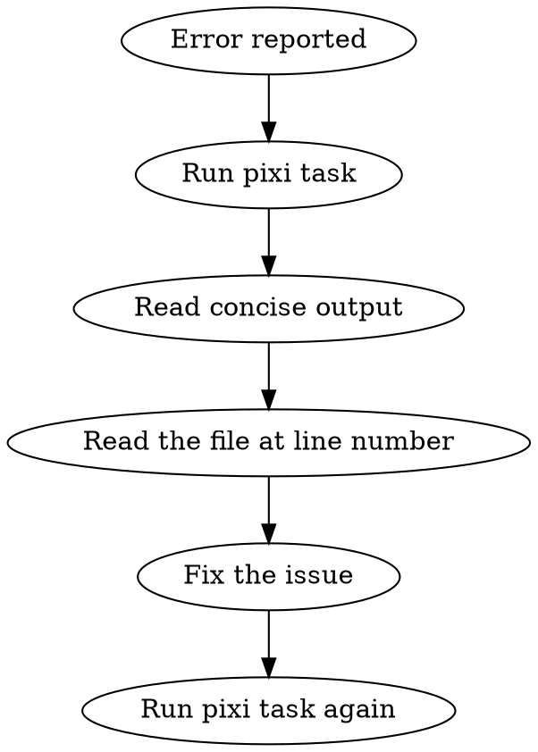

# Python Development Workflow

## The Rule

**Use pixi tasks exclusively. Never bypass them with raw tool commands.**

Projects define `pixi run test`, `pixi run typecheck`, `pixi run ruff-lint` etc. for a reason: they parse output to show ONE error at a time with concise, actionable information.

## Why This Matters

The concise output IS the information you need:
- Test failures: test name, file:line, error message
- Type errors: file:line, error type, context
- Lint errors: file:line, rule code, message

You do NOT need verbose output. The error message + file location is sufficient to understand and fix the issue.

## Commands

| Task | Command | Never Do |
|------|---------|----------|
| Run tests | `pixi run test` | `pytest ...` directly |
| Type check | `pixi run typecheck` | `basedpyright ...` directly |
| Lint | `pixi run ruff-lint` | `ruff ...` directly |
| Format | `pixi run ruff-format` | `ruff format ...` directly |

**Never use `--verbose` or `-v` flags** even on pixi tasks. The concise output is intentional.

## Workflow



1. Run the appropriate pixi task
2. Read the concise error output (file:line + message)
3. Read the source file at that location
4. Fix the issue
5. Re-run the task to verify

## Red Flags - STOP

If you're thinking any of these, you're about to violate the workflow:

- "I need verbose output to understand this"
- "Let me run pytest/basedpyright/ruff directly for more info"
- "I'll use --verbose/-v to see all errors"
- "I need to see the full test output"
- "Let me run all checks at once to see everything"

**All of these mean: Trust the concise output. Fix ONE error. Re-run.**

## Rationalization Table

| Excuse | Reality |
|--------|---------|
| "Need verbose for more context" | File:line + message IS context. Read the file. |
| "Want to see all errors at once" | Fix one at a time. Errors cascade - fixing one may resolve others. |
| "Direct tool gives more control" | Pixi tasks ARE the defined interface. They exist for a reason. |
| "Test output was too brief" | Brief = efficient. You have file + line + assertion message. |
| "Type checker summary incomplete" | You have file:line + error. Read the code there. |
| "The task has a --verbose flag" | Yes, for human debugging. You don't need it. Trust concise output. |
| "Error message is vague" | Read the source file. The code context clarifies the error. |

## What the Concise Output Provides

**Test failure:**
```
test_name (tests/file.py:45) - AssertionError: Expected X but got Y
```
You have: test name, exact file, exact line, the assertion that failed.

**Type error:**
```
/path/file.py:15:10 - error: Type "str" cannot be assigned to type "int"
```
You have: exact file, exact line, exact column, exactly what's wrong.

**Lint error:**
```
file.py:
  10:5: E501 Line too long
```
You have: file, line, column, rule code, description.

## The Concise Output Is Enough

Do NOT request verbose output. The information provided is sufficient:
- You know WHERE the error is (file + line)
- You know WHAT the error is (message)
- Read the source code at that location to understand WHY
