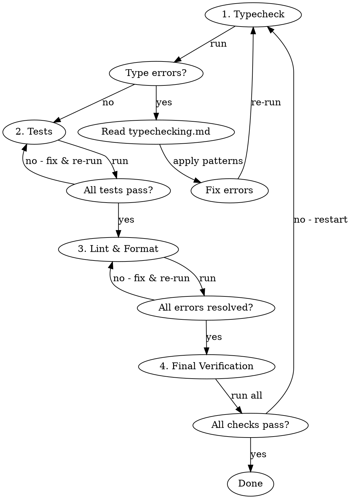

# Python Development Workflow

## Setup - First Time Only

Before using pixi tasks, ensure the project is configured. Check if tasks exist:

```bash
pixi task list | grep -E "^(test|typecheck|ruff-lint)"
```

If tasks are missing, set up the project:

1. **Copy scripts to `.config/`:**
   ```bash
   mkdir -p .config
   cp ${CLAUDE_PLUGIN_ROOT}/scripts/run_silent_*.sh .config/
   cp ${CLAUDE_PLUGIN_ROOT}/scripts/.pytest.toml .config/
   cp ${CLAUDE_PLUGIN_ROOT}/scripts/.ruff-src.toml .config/
   cp ${CLAUDE_PLUGIN_ROOT}/scripts/.ruff-tests.toml .config/
   chmod +x .config/run_silent_*.sh
   ```

2. **Copy pyrightconfig.json to project root:**
   ```bash
   cp ${CLAUDE_PLUGIN_ROOT}/scripts/pyrightconfig.json .
   ```

3. **Merge pixi tasks into `pixi.toml`:**
   - Read `${CLAUDE_PLUGIN_ROOT}/scripts/pixi.toml`
   - Add the feature definitions to the project's `pixi.toml`
   - Add the features to the appropriate environments

After setup, verify: `pixi run -q -e dev test --help`

## The Rule

**Use pixi tasks exclusively. Never bypass them with raw tool commands.**

## Commands

| Task | Command | Optional Args |
|------|---------|---------------|
| Run tests | `pixi run -q -e dev test` | `test_pattern` |
| Type check | `pixi run -q -e dev typecheck` | `file_path` |
| Lint | `pixi run -q -e dev lint` | `file_path`, `--src`, `--tests` |
| Format | `pixi run -q -e dev ruff-format` | `file_path`, `--src`, `--tests` |

**Never use `--verbose` or `-v` flags.** The concise output is intentional.

## Workflow

**Execute checks in this order. Complete each phase before moving to the next.**



### Phase 1: Type Checking

1. Run `pixi run -q -e dev typecheck`
2. For missing stub errors (`reportMissingTypeStubs`), see [Missing Type Stubs](#missing-type-stubs)
3. Re-run until clean

### Phase 2: Tests

1. Run `pixi run -q -e dev test`
2. Fix all test failures before proceeding
3. Re-run until all tests pass

### Phase 3: Linting & Formatting

1. Run `pixi run -q -e dev lint`
2. Fix all lint and format errors
3. Re-run until clean

### Phase 4: Final Verification

After completing all phases, run all checks together to catch regressions:

```bash
pixi run -q -e dev typecheck && pixi run -q -e dev test && pixi run -q -e dev lint
```

**If any check fails, restart from Phase 1.**

### Per-Error Loop

For each error within a phase:
1. Read the concise output (file:line + message)
2. Read the source file at that location
3. Fix the issue
4. Re-run the task to verify


## The Iron Rule: Fix the Code, Not the Tools

**NEVER suppress, ignore, or work around errors. Fix the actual code.**

Forbidden actions:
- Adding `# type: ignore` or `# noqa` comments
- Adding rules to `pyproject.toml` or config files to disable checks
- Modifying `.ruff.toml`, `pyrightconfig.json`, or similar configs
- Using `@typing.no_type_check` or similar decorators

**The error exists because the code has a problem. Fix the problem.**

## Red Flags - STOP

If you're thinking any of these, you're about to violate the workflow:

- "I'll add a type: ignore comment for now"
- "Let me disable this rule in the config"
- "The type checker is wrong, I'll suppress it"
- "I need verbose output to understand this"
- "Let me run pytest/basedpyright/ruff directly"

## Missing Type Stubs

When you see `reportMissingTypeStubs` errors:

### Step 1: Search for Existing Stub Packages

Common naming conventions:
- `types-<package>` (typeshed convention, e.g., `types-requests`)
- `<package>-stubs` (alternative convention, e.g., `matplotlib-stubs`)

Search PyPI or conda-forge for existing stubs.

### Step 2: Install if Found

```bash
pixi add -q -e dev types-<package>   # or <package>-stubs
```

Re-run typecheck to verify.

### Step 3: Create Custom Stubs if Not Found

If no stub package exists, create custom stubs. Read @references/python-stubs.md for:
- Stub generation with `stubgen`
- Verification with `stubtest`
- Correct stub syntax (`Incomplete` not `Any`)
- Directory setup for pyright/mypy

This is a valid fix—you're adding types, not suppressing errors.
