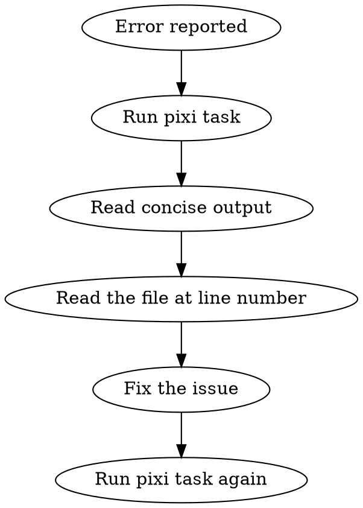

# Python Development Workflow

## Setup - First Time Only

Before using pixi tasks, ensure the project is configured. Check if tasks exist:

```bash
pixi task list | grep -E "^(test|typecheck|ruff-lint)"
```

If tasks are missing, set up the project:

1. **Copy scripts to `.config/`:**
   ```bash
   mkdir -p .config
   cp ${CLAUDE_PLUGIN_ROOT}/scripts/run_silent_*.sh .config/
   cp ${CLAUDE_PLUGIN_ROOT}/scripts/.pytest.toml .config/
   cp ${CLAUDE_PLUGIN_ROOT}/scripts/.ruff-src.toml .config/
   cp ${CLAUDE_PLUGIN_ROOT}/scripts/.ruff-tests.toml .config/
   chmod +x .config/run_silent_*.sh
   ```

2. **Copy pyrightconfig.json to project root:**
   ```bash
   cp ${CLAUDE_PLUGIN_ROOT}/scripts/pyrightconfig.json .
   ```

3. **Merge pixi tasks into `pixi.toml`:**
   - Read `${CLAUDE_PLUGIN_ROOT}/scripts/pixi.toml`
   - Add the feature definitions to the project's `pixi.toml`
   - Add the features to the appropriate environments

After setup, verify: `pixi run test --help`

## The Rule

**Use pixi tasks exclusively. Never bypass them with raw tool commands.**

Projects define `pixi run test`, `pixi run typecheck`, `pixi run ruff-lint` etc. for a reason: they parse output to show ONE error at a time with concise, actionable information.

## Why This Matters

The concise output IS the information you need:
- Test failures: test name, file:line, error message
- Type errors: file:line, error type, context
- Lint errors: file:line, rule code, message

You do NOT need verbose output. The error message + file location is sufficient to understand and fix the issue.

## Commands

| Task | Command | Optional Args | Never Do |
|------|---------|---------------|----------|
| Run tests | `pixi run test` | `test_pattern` | `pytest ...` directly |
| Type check | `pixi run typecheck` | `file_path` | `basedpyright ...` directly |
| Lint | `pixi run ruff-lint` | `file_path`, `--src`, `--tests` | `ruff ...` directly |
| Format | `pixi run ruff-format` | `file_path`, `--src`, `--tests` | `ruff format ...` directly |
| Lint all | `pixi run lint` | — | Running lint commands separately |

Examples:
```bash
pixi run test                     # Run all tests
pixi run test test_auth           # Run tests matching pattern
pixi run typecheck src/api.py     # Type check single file
pixi run ruff-lint --src          # Lint only src/ code
pixi run ruff-lint src/api.py     # Lint single file
```

**Never use `--verbose` or `-v` flags** even on pixi tasks. The concise output is intentional.

## Workflow



1. Run the appropriate pixi task
2. Read the concise error output (file:line + message)
3. Read the source file at that location
4. Fix the issue
5. Re-run the task to verify

## The Iron Rule: Fix the Code, Not the Tools

**NEVER suppress, ignore, or work around errors. Fix the actual code.**

Forbidden actions:
- Adding `# type: ignore` or `# noqa` comments
- Adding rules to `pyproject.toml` or config files to disable checks
- Modifying `.ruff.toml`, `pyrightconfig.json`, or similar configs
- Using `@typing.no_type_check` or similar decorators to suppress errors
- Changing tool settings to be more permissive

**The error exists because the code has a problem. Fix the problem.**

## Red Flags - STOP

If you're thinking any of these, you're about to violate the workflow:

- "I'll add a type: ignore comment for now"
- "Let me disable this rule in the config"
- "This lint rule is too strict, I'll exclude it"
- "The type checker is wrong, I'll suppress it"
- "I need verbose output to understand this"
- "Let me run pytest/basedpyright/ruff directly for more info"
- "I'll use --verbose/-v to see all errors"
- "I need to see the full test output"
- "Let me run all checks at once to see everything"

**All of these mean: Trust the tools. Fix the actual code. Re-run.**

## Rationalization Table

| Excuse | Reality |
|--------|---------|
| "This type error is a false positive" | It's not. The type checker found a real issue. Fix the code. |
| "The lint rule is too strict here" | The rule exists for good reason. Write code that satisfies it. |
| "I'll add an ignore and fix it later" | No. Fix it now. Ignores accumulate and never get fixed. |
| "Changing config is faster" | Suppression is technical debt. The real fix takes the same time. |
| "The type system can't express this" | It almost certainly can. Find the right types/annotations. |
| "Need verbose for more context" | File:line + message IS context. Read the file. |
| "Want to see all errors at once" | Fix one at a time. Errors cascade - fixing one may resolve others. |
| "Direct tool gives more control" | Pixi tasks ARE the defined interface. They exist for a reason. |
| "Test output was too brief" | Brief = efficient. You have file + line + assertion message. |
| "Type checker summary incomplete" | You have file:line + error. Read the code there. |
| "The task has a --verbose flag" | Yes, for human debugging. You don't need it. Trust concise output. |
| "Error message is vague" | Read the source file. The code context clarifies the error. |

## What the Concise Output Provides

**Test failure:**
```
test_name (tests/file.py:45) - AssertionError: Expected X but got Y
```
You have: test name, exact file, exact line, the assertion that failed.

**Type error:**
```
/path/file.py:15:10 - error: Type "str" cannot be assigned to type "int"
```
You have: exact file, exact line, exact column, exactly what's wrong.

**Lint error:**
```
file.py:
  10:5: E501 Line too long
```
You have: file, line, column, rule code, description.

## The Concise Output Is Enough

Do NOT request verbose output. The information provided is sufficient:
- You know WHERE the error is (file + line)
- You know WHAT the error is (message)
- Read the source code at that location to understand WHY

## When an Error Seems Impossible to Fix

If you're stuck, these are valid approaches:

1. **Read more context** - Read the file, surrounding code, imports, base classes
2. **Understand the type** - Read type definitions, protocols, or base classes
3. **Refactor the code** - Sometimes the code structure causes the error; restructure it
4. **Create type stubs** - If a library lacks type hints, create stubs (see below)
5. **Ask the user** - If genuinely uncertain, ask for guidance

These are NOT valid approaches:
- ❌ Adding ignore comments
- ❌ Modifying tool configurations
- ❌ Disabling checks
- ❌ Loosening type strictness

## Missing Type Stubs

When type errors occur because a library has no type hints:

1. **First check** if stubs exist: look for `types-<package>` on PyPI or in typeshed
2. **If no stubs exist**, create them in `src/stubs/`

**REQUIRED:** Use the `python-stubs` skill for creating stubs. It covers:
- Stub generation with `stubgen`
- Verification with `stubtest`
- Correct stub syntax (`Incomplete` not `Any`, etc.)
- Directory setup for pyright/mypy

This is a valid fix—you're adding types, not suppressing errors.
