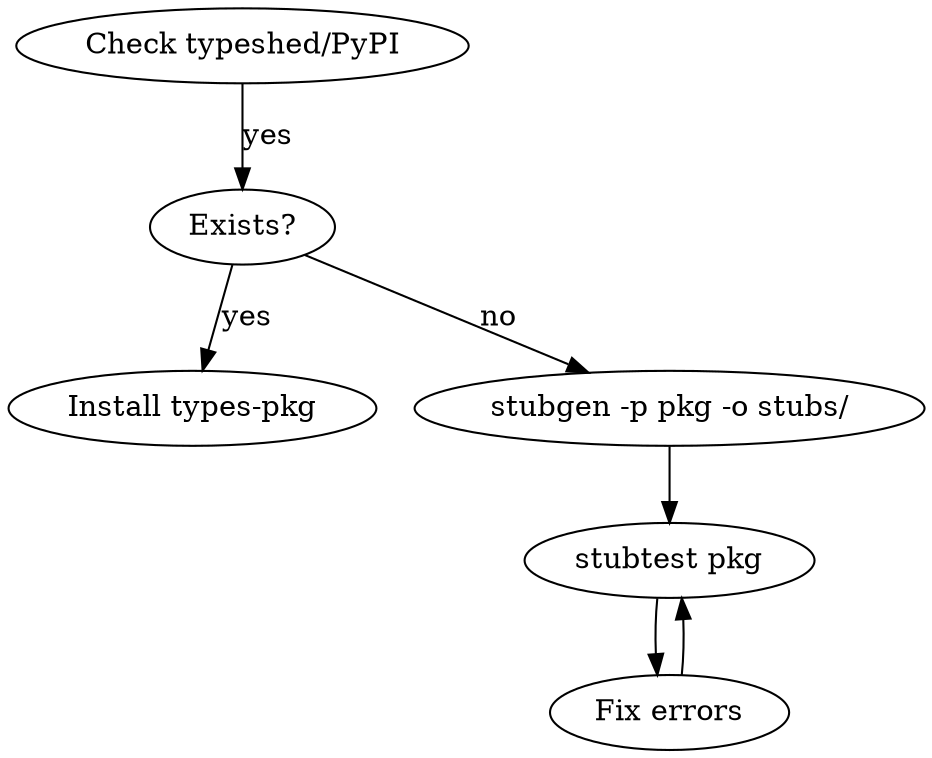

# Creating Python Type Stubs

## Workflow



**First:** Check for existing stubs at pypi.org (`types-somelib`) or typeshed.

## Tools

| Tool | Purpose |
|------|---------|
| `stubgen -p pkg -o stubs/ --inspect-mode` | Generate stubs |
| `python -m mypy.stubtest pkg` | Verify stubs match runtime |
| `flake8-pyi` | Lint stub files |

## Directory Setup

```toml
[tool.mypy]
mypy_path = "stubs"

[tool.pyright]
stubPath = "stubs"
```

**Stub package (PEP 561):** Name it `foopkg-stubs/` (avoid `types-*` prefix, reserved for typeshed). Add `py.typed` marker. For partial stubs, write `partial\n` in `py.typed`.

## Stub Syntax

```python
from typing import Final, overload
from typing_extensions import TypeAlias
from _typeshed import Incomplete

# Private type helpers use underscore prefix
_T = TypeVar("_T")
_StrList: TypeAlias = list[str]

# Constants use Final with literal value
VERSION: Final = "1.0"

# Use ... for bodies; same line for empty classes
class Error(Exception): ...

class Thing:
    name: str
    _internal: Incomplete  # Unknown type (NOT Any)
    def __init__(self, x: int | None = ...) -> None: ...

# Partial classes: add __getattr__ returning Incomplete
class PartiallyTyped:
    known_attr: str
    def __getattr__(self, name: str) -> Incomplete: ...

# Overloads: only @overload variants, NO implementation signature
@overload
def get(key: str) -> str | None: ...
@overload
def get(key: str, default: _T) -> str | _T: ...
```

## Key Rules

| Rule | Example |
|------|---------|
| `Incomplete` for unknowns, not `Any` | `Any` = "cannot express"; `Incomplete` = "TODO" |
| Explicit re-exports | `from .mod import X as X` |
| Covariant params | `Mapping[K,V]` not `dict[K,V]` for input |
| Accept any type | Use `object`, not `Any` |
| Numeric params | `float` accepts `int`, no need for `int \| float` |
| 130 char line limit | Stub style convention |
| No `self`/`cls` annotation | Unless using TypeVar for returns |

## What to Include/Exclude

**Include:** Public API, `__all__` contents, undocumented-but-used items (mark `# undocumented`)

**Exclude:** Private modules (`_internal`), `__main__.py`, tests

## Testing

```bash
python -m mypy.stubtest pkg --allowlist allowlist.txt
```

**Run stubtest after every change.** Also type-check code that imports your stubs to catch false positives.

## typeshed Contribution

Fork `python/typeshed`, add `stubs/pkg/METADATA.toml` + `.pyi` files, run `python scripts/stubtest_third_party.py pkg`, PR.

## Common Mistakes

| Mistake | Fix |
|---------|-----|
| `Any` for unknown types | Use `Incomplete` |
| Implementation signature after overloads | Only `@overload` variants in stubs |
| Missing `-> None` on `__init__` | Always annotate |
| `Union[X, Y]` syntax | Use `X \| Y` |
| `typing.List`, `typing.Dict` | Use `list`, `dict` builtins |
| `typing.Mapping` | Use `collections.abc.Mapping` |
